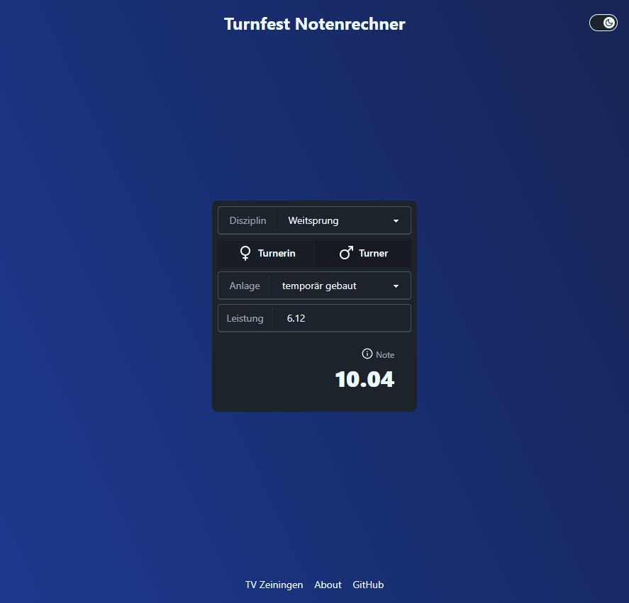

# Notenrechner

Eine einfache, kleine App zur Berechnung der erreichten Note gemäss [STV](https://www.stv-fsg.ch/de/) Leichtathletik Wertung.

> ## [>> Zur App <<](https://tvzeiningen.github.io/notenrechner/)

## Entwicklung

- Anforderungen: Nodejs >? 22
- Installation: `npm install`
- Start: `npm run dev`
- Lint: `npm run lint`

## Deployment

Alle pushes auf `main` lösen ein Deployment App als statische SPA auf [GitHub Pages](https://tvzeiningen.github.io/notenrechner/) aus.